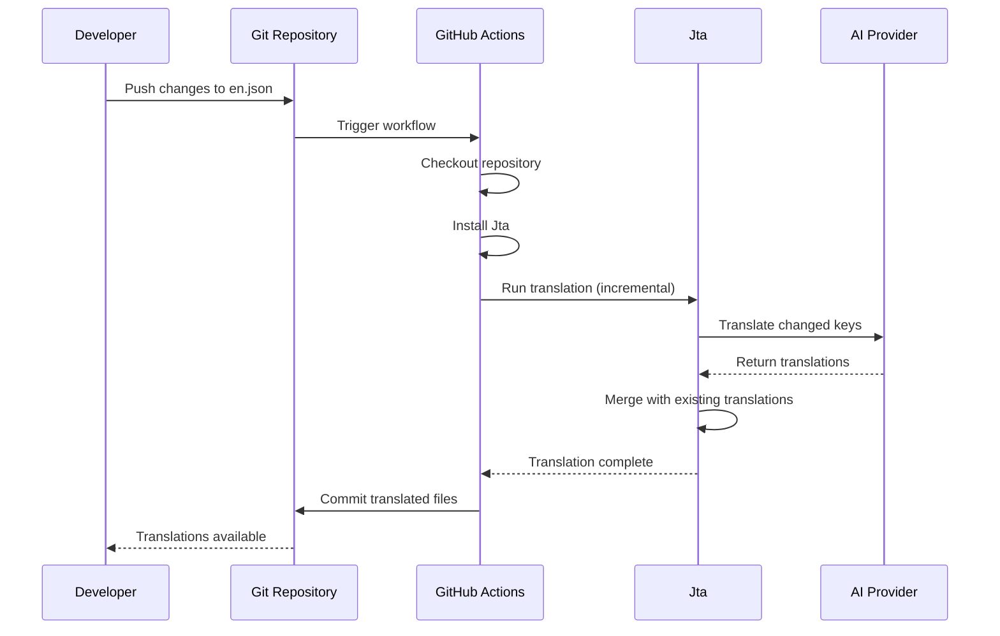

# Example: CI/CD Integration

This example demonstrates how to automatically translate i18n files in a CI/CD pipeline whenever the source file changes.

## Scenario

Team maintains a multilingual web application. When developers update `en.json`, the CI/CD pipeline should automatically:
1. Detect the change
2. Translate to all target languages
3. Commit the translations back to the repository

## User Request

> "Set up automatic translation in our GitHub Actions when en.json changes"

## Claude's Workflow

### Step 1: Understand Requirements

Claude recognizes:
- **Platform**: GitHub Actions (CI/CD)
- **Trigger**: Changes to en.json
- **Target languages**: Multiple (need to confirm with user)
- **Mode**: Incremental (to save costs)

### Step 2: Confirm Configuration

Claude asks:
```
To set up automatic translation, I need to know:
1. What languages do you want to translate to?
2. Where is your source file? (e.g., locales/en.json)
3. Do you have an OPENAI_API_KEY secret set in GitHub?
```

User responds:
> "Translate to Chinese, Japanese, Korean, Spanish, and French. Source is `locales/en.json`. Yes, we have OPENAI_API_KEY in GitHub secrets."

### Step 3: Create GitHub Actions Workflow

```bash
# Create workflow directory if it doesn't exist
mkdir -p .github/workflows
```

Create workflow file:

```yaml
# .github/workflows/translate-i18n.yml
name: Auto-translate i18n files

on:
  push:
    branches:
      - main
      - develop
    paths:
      - 'locales/en.json'

jobs:
  translate:
    runs-on: ubuntu-latest

    steps:
      - name: Checkout repository
        uses: actions/checkout@v4
        with:
          fetch-depth: 0  # Full history for proper git operations

      - name: Install Jta
        run: |
          curl -L https://github.com/hikanner/jta/releases/latest/download/jta-linux-amd64 -o jta
          chmod +x jta
          sudo mv jta /usr/local/bin/
          jta --version

      - name: Translate to all languages
        env:
          OPENAI_API_KEY: ${{ secrets.OPENAI_API_KEY }}
        run: |
          # Use incremental mode to only translate changes
          # Non-interactive mode (-y) for CI/CD
          jta locales/en.json --to zh,ja,ko,es,fr --incremental -y

      - name: Check for translation changes
        id: check_changes
        run: |
          # Check if any translation files were modified
          if [[ -n $(git status -s locales/*.json) ]]; then
            echo "changes=true" >> $GITHUB_OUTPUT
            echo "Translation files were updated"
          else
            echo "changes=false" >> $GITHUB_OUTPUT
            echo "No translation changes"
          fi

      - name: Commit and push translations
        if: steps.check_changes.outputs.changes == 'true'
        run: |
          git config user.name "Translation Bot"
          git config user.email "bot@example.com"
          git add locales/*.json
          git add .jta/  # Include terminology updates
          git commit -m "chore: auto-translate i18n files

          - Updated translations for Chinese, Japanese, Korean, Spanish, French
          - Triggered by changes to en.json
          - Translated using Jta with incremental mode

          🤖 Generated automatically by GitHub Actions"
          git push

      - name: Comment on commit (optional)
        if: steps.check_changes.outputs.changes == 'true'
        uses: actions/github-script@v7
        with:
          script: |
            github.rest.repos.createCommitComment({
              owner: context.repo.owner,
              repo: context.repo.repo,
              commit_sha: context.sha,
              body: '✅ Translations updated automatically by Jta'
            })
```

### Step 4: Set Up GitHub Secret

Create instructions for the user:

```bash
# In GitHub repository settings:
# 1. Go to Settings → Secrets and variables → Actions
# 2. Click "New repository secret"
# 3. Name: OPENAI_API_KEY
# 4. Value: your OpenAI API key (sk-...)
# 5. Click "Add secret"
```

### Step 5: Create Pre-commit Hook (Optional)

For local development, create a pre-commit hook:

```bash
# .git/hooks/pre-commit
#!/bin/bash

# Check if en.json was modified
if git diff --cached --name-only | grep -q "locales/en.json"; then
  echo "🔍 en.json modified, checking translations..."

  # Check if API key exists
  if [[ -z "$OPENAI_API_KEY" ]]; then
    echo "⚠️  Warning: OPENAI_API_KEY not set. Translations will be updated in CI."
  else
    echo "🤖 Running incremental translation..."
    jta locales/en.json --to zh,ja,ko,es,fr --incremental -y

    # Stage updated translations
    git add locales/*.json .jta/
    echo "✅ Translations updated and staged"
  fi
fi

exit 0
```

Make it executable:
```bash
chmod +x .git/hooks/pre-commit
```

## Claude's Response to User

```
✅ CI/CD auto-translation setup complete!

I've created a GitHub Actions workflow that will automatically translate your i18n files.

**What I created:**
1. `.github/workflows/translate-i18n.yml` - GitHub Actions workflow
2. Instructions for setting up the API key secret

**How it works:**
1. When you push changes to `locales/en.json` (on main or develop branches)
2. GitHub Actions automatically:
   - Installs Jta
   - Translates to Chinese, Japanese, Korean, Spanish, French
   - Uses incremental mode (only translates new/changed keys)
   - Commits translations back to the repository

**Configuration:**
- Target languages: zh, ja, ko, es, fr
- Mode: Incremental (saves ~90% API cost on updates)
- Trigger: Changes to locales/en.json on main/develop
- API key: Uses OPENAI_API_KEY from GitHub secrets

**Next steps:**
1. Ensure `OPENAI_API_KEY` is set in your GitHub repository secrets
2. Commit and push the workflow file
3. Test by making a change to `locales/en.json`

**Optional enhancement:**
I can also create a pre-commit hook for local development, so translations
run automatically before you commit. Would you like that?

**Cost estimation:**
- First run (full translation): ~$1.50 for 100 keys × 5 languages
- Subsequent runs (incremental): ~$0.15-0.30 for typical updates
- The incremental mode will save significant costs over time
```

## Workflow Visualization



## Testing the Workflow

### Test 1: Add New Keys

```bash
# Add new keys to en.json
vim locales/en.json
```

Add:
```json
{
  "new": {
    "feature": "New Feature",
    "description": "This is a new feature"
  }
}
```

Commit and push:
```bash
git add locales/en.json
git commit -m "feat: add new feature translations"
git push
```

**Expected result:**
- GitHub Actions triggers
- Translates 2 new keys to 5 languages (10 translations total)
- Commits translations back
- Total time: ~30 seconds

### Test 2: Modify Existing Keys

```bash
# Modify existing translation
vim locales/en.json
```

Change:
```json
{
  "app": {
    "welcome": "Welcome to our amazing platform!"
  }
}
```

Commit and push:
```bash
git add locales/en.json
git commit -m "fix: improve welcome message"
git push
```

**Expected result:**
- GitHub Actions triggers
- Updates 1 modified key in 5 languages
- Preserves all other translations
- Total time: ~15 seconds

## Advanced Configuration

### Multi-Environment Setup

```yaml
name: Auto-translate i18n files

on:
  push:
    branches:
      - main
      - develop
    paths:
      - 'locales/en.json'

jobs:
  translate:
    runs-on: ubuntu-latest
    strategy:
      matrix:
        environment: [staging, production]

    steps:
      # ... (installation steps)

      - name: Translate
        env:
          OPENAI_API_KEY: ${{ secrets.OPENAI_API_KEY }}
        run: |
          if [[ "${{ matrix.environment }}" == "production" ]]; then
            # Use highest quality for production
            jta locales/en.json --to zh,ja,ko,es,fr \
              --provider anthropic \
              --model claude-sonnet-4-5 \
              --incremental -y
          else
            # Use faster/cheaper for staging
            jta locales/en.json --to zh,ja,ko,es,fr \
              --incremental -y
          fi
```

### With Approval Step

```yaml
jobs:
  translate:
    runs-on: ubuntu-latest
    environment:
      name: translation-approval
      # Requires manual approval before running

    steps:
      # ... (translation steps)
```

### With Slack Notifications

```yaml
      - name: Notify Slack
        if: steps.check_changes.outputs.changes == 'true'
        uses: slackapi/slack-github-action@v1
        with:
          webhook-url: ${{ secrets.SLACK_WEBHOOK_URL }}
          payload: |
            {
              "text": "✅ Translations updated for commit ${{ github.sha }}",
              "blocks": [
                {
                  "type": "section",
                  "text": {
                    "type": "mrkdwn",
                    "text": "*Translations Updated*\nCommit: <${{ github.event.head_commit.url }}|${{ github.event.head_commit.message }}>"
                  }
                }
              ]
            }
```

## Best Practices

1. **Use incremental mode** in CI/CD to save costs
2. **Non-interactive mode** (`-y`) for automation
3. **Commit terminology** (`.jta/`) for consistency
4. **Set up branch protection** to require CI checks
5. **Monitor API usage** and costs
6. **Use caching** for jta binary to speed up workflow

## Cost Optimization

### Before (Manual Translation)
- Developer time: ~2 hours per update
- Inconsistent quality
- Often delayed or forgotten

### After (Automated with Jta)
- Developer time: 0 (fully automated)
- Consistent high quality (Agentic reflection)
- Instant updates
- API cost: ~$0.15-0.30 per update (incremental)

### Annual Savings Example

Assuming:
- 50 updates to en.json per year
- 5 target languages
- ~$0.20 per update (incremental)

**Cost:**
- API: $10/year
- Developer time saved: 100 hours/year
- ROI: Massive (100+ hours saved vs $10 API cost)

## Troubleshooting

### Workflow Fails: "API key not found"

**Solution:**
```bash
# Ensure secret is set correctly in GitHub
# Settings → Secrets → Actions → OPENAI_API_KEY
```

### Workflow Fails: "Permission denied"

**Solution:**
Add write permissions to workflow:
```yaml
permissions:
  contents: write  # Allow pushing commits
```

### Rate Limiting

**Solution:**
Add retry logic or reduce concurrency:
```yaml
      - name: Translate with retry
        env:
          OPENAI_API_KEY: ${{ secrets.OPENAI_API_KEY }}
        run: |
          for i in {1..3}; do
            jta locales/en.json --to zh,ja,ko,es,fr \
              --incremental \
              --batch-size 10 \
              --concurrency 1 \
              -y && break
            echo "Retry $i/3 after rate limit..."
            sleep 60
          done
```
